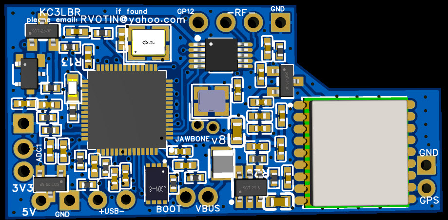

# JAWBONE Balloon Tracker

1. [Overview](#overview)
2. [What does "JAWBONE" mean](#what-does-jawbone-mean)
3. [Pros and cons](#pros-and-cons)
4. [Power requirements and specs](#power-requirements-and-specs)
5. [**QUICK START** instructions](#quick-start-instructions)
6. [Configuration menu reference](#configuration-menu-reference)
7. [Geofencing](#geofencing)
8. [Compiling it yourself](#compiling-it-yourself)
9. [What is "basic" telemetry](#what-is-basic-telemetry)
10. [How to pick a "channel"](#how-to-pick-a-channel)
11. [Extended Telemetry overview](#extended-telemetry-overview)
12. [Extended Telemetry specifics](#extended-telemetry-specifics)
13. [Temperature sensors (DS18B20)](#temperature-sensors-ds18b20)
14. [Viewing telemetry on wsprtv.com](#viewing-telemetry-on-wsprtvcom)
15. [Other tracking sites](#other-tracking-sites)
16. [Schematics](#schematics)
17. [Pictures](#pictures)
18. [Making Hydrogen](#making-hydrogen)
19. [Ordering PCBs](#ordering-pcbs)
20. [Useful Links](#useful-links)
21. [Special Features](#special-features)
22. [Acknowledgements](#acknowledgements)
23. [Disclaimers](#disclaimers)

---

## Overview

JAWBONE is software and a custom PCB design for an RP2040-based WSPR beacon. It's intended for tracking high-altitude superpressure balloons, also called pico balloons.


JAWBONE was created by KC3LBR as an evolution of his [pico-WSPRer](https://github.com/EngineerGuy314/pico-WSPRer) project. It's very similar, except that JAWBONE uses an MS5351 clock generator chip to generate RF instead of abusing the RP2040's internal PLL oscillator. It's only intended to be used with the custom PCB. You probably could still assemble one from a Raspberry Pi Pico and external components, but that isn't tested or documented.

This version adds:
- **Geofencing:** the tracker won't transmit over the United Kingdom, Yemen or North Korea.
- **A bug fix:** a stack buffer overflow in the grid string is fixed.
- **Updated documentation:** extended telemetry and wsprtv.com decoding are documented as the current firmware actually works.

See the [README](../README.md) for the full list of changes.

---

## What does "JAWBONE" mean

JAWBONE is an acronym for **Just Another WSPR Beacon Of Noisy Electronics**. The fact that the PCB kinda sorta has a jawbone shape is actually coincidence.


The acronym starts with "Just Another" because (unlike the pico-WSPRer) this one uses a Si5351/MS5351 just like practically every other compact WSPR beacon out there. And it's considered "Noisy Electronics" because technically the output of the xx5351 is a square wave, full of juicy harmonics. See the [Disclaimers](#disclaimers) section.

---

## Pros and cons

**Pros:**
* The PCB, easily ordered from JLCPCB, arrives as a complete tracker; no external Raspberry Pi Pico is needed.
* It's cheaper than commercial trackers: about $28 or less, even with tariffs and shipping.
* It's very light: 2.2 grams.
* It's fully open source, free and libre. You have permission to fork it, change it and so on (MIT License).
* An on-board voltage booster allows running from about 2 V.
* Several pre-configured Extended Telemetry options, including high-resolution positioning and analog voltages.
* **Geofencing:** no transmissions over the UK, Yemen or North Korea (see [Geofencing](#geofencing)).
* Much better performance than the pico-WSPRer: higher signal output level and purity, and a simpler GPS antenna requirement.
* After the initial program is loaded, all configuration is done over a serial terminal (PuTTY or equivalent) and stored in non-volatile flash memory. There's no need to recompile.

**Cons:**
* JLCPCB's minimum order quantity is 5.
* It's somewhat more expensive than a Traquito/Pi-Pico combination, and definitely more expensive than building a pico-WSPRer.
* It only does WSPR on the HF ham bands. There's no VHF or LoRa APRS, and no LoRaWAN.
* Configuration is done over a serial terminal. There's no browser-based or standalone GUI.
* The geofence uses 2° × 1° grid squares, so it also silences some nearby areas (for example Seoul, Dublin and Calais). The countries are fixed at compile time.
* Use at your own risk. This is open-source hobby firmware, not a commercial product with a vendor behind it. A commercial tracker such as a U4B from QRP Labs or a WSPR-TX-pico from ZachTek comes from a reputable vendor with a good-faith obligation to give you a working device.
* There's no RF output filtering on board. You can add your own if needed; see the disclaimer.

---

## Power requirements and specs

The intended power source is solar cells. At a nominal input voltage of **3.3 V**, the current consumption is:
* 10 mA at idle
* 34 mA when the GPS receiver is active
* 56 mA when transmitting double-ended into 70 Ω

If you rely on the on-board MCP1640T to boost the input voltage, the current consumption **increases**. For example, at **2.5 V input (a typical 4-cell 52×19 mm panel), the input current while transmitting is about 80 mA.**

The pin marked "5V" feeds a 3.3 V LDO regulator (XC6206), which then feeds VBUS. The MCP1640T boosts VBUS if needed. So "5V" is a universal power input that tolerates roughly 2 V to 6 V. If your power source will never exceed 3.3 V, you can wire it directly to the VBUS input and bypass the LDO.

While a geofenced area is being crossed, the tracker skips its transmissions but keeps the GPS on so it can check again every 10 minutes. The average current is then about the GPS-active figure above.

Misc specs:
* Total weight is 2.2 grams, not including antennas.
* The RP2040 main clock runs at 18 MHz.
* An MS5351 generates the RF: dual-ended, with two channels driven in anti-phase.
* The GPS is an ATGM336H dual-constellation GNSS receiver (GPS and BeiDou).
* Recommended GPS antenna: a 46 mm monopole, 28 AWG or similar.
* Recommended transmit antenna: a center-fed dipole trimmed to your band, attached to the two RF pins.

---

## Quick Start instructions

* The pre-compiled firmware is [`build/JAWBONE.uf2`](../build/JAWBONE.uf2) in this repository.
* The RP2040 works like a Raspberry Pi Pico and uses its USB connection for loading the program and for configuration.
* The first time it's connected to a computer over USB, the RP2040 shows up as a USB thumb drive. Drag and drop `JAWBONE.uf2` onto it.
* After that, the tracker won't enter thumb-drive mode again unless you connect the BOOT pin to ground before plugging in the USB cable. You only need to do that when loading a new version of the program.
* After rebooting, the device shows up as a generic serial device. Check Device Manager (or your OS equivalent) to see which COM port it's on.


* Unplug the tracker. Set up PuTTY, HyperTerminal or your serial terminal of choice for that COM port at 115200 baud.


* Plug in the tracker, click connect in PuTTY straight away, and start tapping the space bar to interrupt the boot process. The boot countdown lasts about 8 seconds. You should see the configuration menu:


The screenshot is from an earlier build. This firmware's banner ends in `+ geofence v1`, and the settings list includes a line starting `Geofence: no TX over UK, Yemen, North Korea`.

Configuration is mostly self-explanatory. For example, to change the callsign press `C`, type your callsign and press Enter. See [Configuration menu reference](#configuration-menu-reference) for every option.

**VERY IMPORTANT! The first time you configure a JAWBONE, the menu will probably read garbage values out of NVRAM. Go through EACH AND EVERY configuration option and enter a value, even if it already looks correct!**

Some other tips:
* The default band is H (20 m). The options are F:40, G:30, H:20, I:17, J:15, K:12, L:10 and M:6. For example, to transmit on 10 m, enter `L` for the band.
* The Extended Telemetry configuration takes exactly 3 characters. To disable it completely, enter three hyphens: `---`.
* Each character is one of the 3 available ET slots (see [Extended Telemetry specifics](#extended-telemetry-specifics)). For example, `72-` makes the first ET slot type 7 (high-resolution position), the second type 2 (bus voltage and temperature sensor) and disables the third. **At least one ET slot must be disabled** so the tracker can re-enable the GPS receiver and get a fresh position fix. If the setting in NVRAM is invalid, the tracker uses `78-`.
* Set Verbosity and Optional Debug to 0 for flight. They're explained in [Special Features](#special-features).
* The LED is very useful for troubleshooting. The blink patterns mean:
    * **Normal blinking (about 5 per second):** the boot countdown, which gives you time to connect and interrupt the boot.
    * **Rapid blinking (about 10 per second):** no serial data is coming from the GPS module. This is normal for a few seconds during boot.
    * **1 blink, then a pause:** waiting for a valid GPS fix; not transmitting.
    * **2 blinks, then a pause:** valid GPS fix; waiting for the start of the timeslot to transmit.
    * **3 blinks, then a pause:** transmitting, with the GPS receiver powered off.
    * **"Breathing" (brightness slowly rising and falling):** corrupted data was detected in NVRAM. The tracker reboots automatically after about 10 seconds and tries again. Press any key during breathing to enter the menu and fix the settings.

---

## Configuration menu reference

The menu is entered by pressing a key during the boot countdown. It can also be entered at any time while the tracker is running, by pressing a key in the serial terminal. If no key is pressed for 60 seconds, the menu reboots the tracker. That way, a stray keypress can't leave a tracker stuck in the menu during flight.

| Key | Setting | Values | Notes |
|---|---|---|---|
| `C` | Callsign | up to 6 characters | Converted to upper case |
| `U` | U4B channel | 0–599 | Sets the telemetry ID (Id13), start minute and frequency lane; these are shown next to the channel. See [How to pick a "channel"](#how-to-pick-a-channel) |
| `B` | Band | `F`–`M` | See the table below. Changing the band recalculates the start minute |
| `T` | Extended Telemetry config | 3 characters, e.g. `72-` | See [Extended Telemetry specifics](#extended-telemetry-specifics) |
| `V` | Verbosity | 0–9 | 0 for flight. See [Special Features](#special-features) |
| `O` | Optional debug | 0–255 (bit field) | 0 for flight. See [Special Features](#special-features) |
| `F` | Frequency output | frequency in MHz, e.g. `14.097` | Antenna tuning and current-measurement mode; `0` exits |
| `X` | Exit | | Saves and reboots |

| Band key | Band | Base frequency shown in menu (Hz) |
|---|---|---|
| F | 40 m | 7,040,100 |
| G | 30 m | 10,140,200 |
| H | 20 m (default) | 14,097,100 |
| I | 17 m | 18,106,100 |
| J | 15 m | 21,096,100 |
| K | 12 m | 24,926,100 |
| L | 10 m | 28,126,100 |
| M | 6 m | 50,294,500 |

The channel's lane (1–4) shifts the transmit frequency from that base by −80, −40, +40 or +80 Hz.

The settings screen also shows a fixed line reporting the geofence. It isn't a setting; the fenced countries are compiled into the firmware.

---

## Geofencing

The tracker won't transmit over the **United Kingdom, Yemen or North Korea**.

**How it works:**
- Before every 10-minute transmit cycle, it checks its current GPS position against a list of 132 four-character Maidenhead grid squares, each 2° longitude × 1° latitude.
- If the position is inside one of them, the whole cycle is skipped: the WSPR message, the basic telemetry and all extended telemetry.
- The GPS stays on, and the tracker checks again at the next cycle start. Transmissions resume on the first cycle after the balloon leaves the fenced squares.

**The check covers the first transmission after power-up too.** For a solar balloon that power-up happens every sunrise, wherever it drifted overnight.

**What's fenced.** The squares cover each country's land (including islands such as Shetland, Scilly and Socotra), its 12 nautical mile territorial sea, and a further 25 km margin. The margin exists because the position is only checked at the start of a cycle, and the GPS is off while transmitting. A cycle with two ET slots transmits for about 8 minutes, which is about 25 km of drift at jet-stream speeds.

**The cost: nearby places are silenced too.** Because the squares are coarse, the fence also blocks:
- Seoul and most of northern South Korea
- Dublin and eastern Ireland
- Calais and Lille in northern France
- A strip of Belgium
- Parts of Saudi Arabia, Oman, China, Somalia, Eritrea, Djibouti and far-eastern Russia

Expect gaps in your track there.

**To confirm it's working**, set verbosity to 1 or higher. Each skipped cycle then prints `TX cycle suppressed by geofence (XXnn)` on the USB serial port.

**To change the fenced countries**, see [Geofence tool](../README.md#5-geofence-tool-toolsgeofence) in the README. It explains how to regenerate the list, how the code was tested, and how to bench-test it before launch.

---

## Compiling it yourself

You only need this if you change the source code. The instructions below work on a basic Linux system such as a Raspberry Pi, a virtual machine on Windows or a headless Debian install. You need the rudiments of Linux and C, but no experience with Makefiles, compilers or SDKs.

Install the compiler and tools, and get the Raspberry Pi Pico SDK and pico-extras:

```
sudo apt-get update
sudo apt install cmake ninja-build gcc-arm-none-eabi libnewlib-arm-none-eabi libstdc++-arm-none-eabi-newlib build-essential git python3
git clone https://github.com/raspberrypi/pico-sdk.git
git clone https://github.com/raspberrypi/pico-extras.git
cd pico-sdk && git submodule update --init && cd ..
echo "export PICO_SDK_PATH=~/pico-sdk" >> ~/.bashrc
echo "export PICO_EXTRAS_PATH=~/pico-extras" >> ~/.bashrc
source ~/.bashrc
```

Then, from this repository's folder:

```
cmake -S . -B build-out -G Ninja
ninja -C build-out
```

The result is `build-out/JAWBONE.uf2`. The shipped `build/JAWBONE.uf2` was built with Pico SDK 2.3.1, pico-extras commit `52fd7a7` and arm-none-eabi-gcc 13.2.1. The older `./build.sh` script also works.

To test the scheduler and geofence on a PC without any hardware, run `tests/host/run_tests.sh`. It only needs `gcc`.

---

## What is "basic" telemetry

Regular WSPR transmissions last 2 minutes and carry only a callsign and a 4-character Maidenhead grid square. "Basic" telemetry was originally created by Hans Summers (G0UPL) of qrp-labs.com. It sends a second 2-minute transmission that encodes 2 more grid characters, plus altitude, voltage and temperature. He also developed the "600 channel" system that lets many users share Basic Telemetry. Kevin Normoyle (AD6Z) maintains a community-driven document that aims to be the de facto definition of the telemetry protocols and the channel system: [https://github.com/knormoyle/U4BProtocol](https://github.com/knormoyle/U4BProtocol)

---

## How to pick a "channel"

"Channel" here doesn't mean a frequency. It's one of 600 combinations of time slot, frequency lane and ID that identify your telemetry. See the U4B Protocol document linked in the previous section.

It's **very important to choose a channel that isn't already in use, and to reserve/register it** so others don't use it.

Best practice may change, but currently you can check which channels are free at:
- [https://wsprtv.com/tools/channel_map.html](https://wsprtv.com/tools/channel_map.html)
- [https://traquito.github.io/channelmap/](https://traquito.github.io/channelmap/)

You can reserve a channel at any of:
- [https://traquito.github.io/channelmap/](https://traquito.github.io/channelmap/)
- [http://lu7aa.org.ar/wsprset.asp](http://lu7aa.org.ar/wsprset.asp)
- [http://qrp-labs.com/tracking](http://qrp-labs.com/tracking)

---

## Extended Telemetry overview

"Extended" telemetry is a way for trackers to send extra, arbitrary data. It gets received and recorded by the same worldwide WSPR monitoring network used for regular beacons. More recently it's called "Custom Telemetry" (CT).

**History:**
- Hans Summers first implemented it on his U4B trackers, initially limited to M and N (two large integers). Documentation from that period sometimes calls this TELEN.
- Near the end of 2024, Doug Malnati led the development of a more flexible, defined form of Extended Telemetry, now documented in the [U4B Protocol](https://github.com/knormoyle/U4BProtocol).
- The pico-WSPRer was one of the first trackers to implement it. Much of its documentation and code called it DEXT (Doug's EXtended Telemetry); that name was needed while DEXT and TELEN were both in service. Today "Extended Telemetry" or just "ET" is assumed to mean the newer form. Its first standardized message format is called **ET0**.

**This firmware uses the newer, header-less CT format.** In February–May 2026 the firmware moved from ET0 to the header-less CT format; the menu calls it "GET" (Generic Extended Telemetry). The two formats differ like this:

| | ET0 | CT (this firmware) |
|---|---|---|
| Telemetry-type bit | yes | yes |
| Slot number | yes | yes |
| Reserved field | yes | no |
| Type field | yes | no |
| Space left for data | less | about 6 more bits |

This matters when you set up a decoder. ET0 decoder definitions, such as wsprtv `et_dec=et0:0,...` links or Traquito-style JSON with the ET0 header, mostly reject or misread this firmware's messages. Use the CT definitions in [Viewing telemetry on wsprtv.com](#viewing-telemetry-on-wsprtvcom).

**The 10-minute cycle.** The U4B protocol runs on a 10-minute cycle:
- A 2-minute standard WSPR transmission.
- A 2-minute Basic Telemetry transmission.
- 3 more slots that can theoretically be used for Extended Telemetry.

JAWBONE uses at most 2 ET slots at a time. The GPS receiver is only powered when the tracker isn't transmitting, so **at least one ET slot must be left open** for it to get an updated position and time fix.

---

## Extended Telemetry specifics

Set the ET types with the `T` menu option: three characters, one per ET slot, where `-` disables a slot.

**Slot numbering differs between the tracker and the tracking sites:**

| Tracker ET slot | wsprtv.com slot | Traquito slot |
|---|---|---|
| 1 | 2 | 3 |
| 2 | 3 | 4 |
| 3 | 4 | 5 |

Each ET type packs the values listed below. Voltages are in hundredths of a volt unless stated otherwise. **Values outside a field's range wrap around**; the firmware stores the value modulo the range. The last column is the wsprtv.com extractor list for that type; see [Viewing telemetry on wsprtv.com](#viewing-telemetry-on-wsprtvcom) for how to use it.

| Type | Contents (in packing order) | wsprtv extractors |
|---|---|---|
| `-` | Slot disabled | |
| `0` | Minutes since boot (0–1000); seconds the GPS took to get a fix this cycle (0–1000); GPS valid (0/1); satellites (0–60) | `1001:0:1,1001:0:1,2:0:1,61:0:1` |
| `1` | ADC0, ADC1, ADC2 in **tenths** of a volt (0–35.0, i.e. 0–3.5 V) | `351:0:0.1,351:0:0.1,351:0:0.1` |
| `2` | Bus voltage (ADC3 × 3 for the divider; 0–9.00 V); temperature sensor **#1** magnitude, °F (0–120); its sign (1 = negative); satellites (0–60) | see [the type 2 decoder](#type-2-with-a-signed-temperature) |
| `3` | Temperature sensor **#2** magnitude and sign; sensor **#3** magnitude and sign (°F) | `121:0:1,2:0:1,121:0:1,2:0:1` |
| `4` | Temperature sensor **#4** magnitude and sign; sensor **#5** magnitude and sign (°F) | `121:0:1,2:0:1,121:0:1,2:0:1` |
| `5` | High-precision grid characters 7, 8, 9, 10 (digit, digit, letter A–X as 0–23, letter); minutes since boot ÷ 10 (0–100); GPS fix seconds ÷ 10 (0–100). **Must be in the first ET slot.** | `10:t100,10:t101,24:0:1,24:0:1,101:0:10,101:0:10` |
| `6` | Idle voltage (0–5.00 V); voltage while transmitting (0–5.00 V); minutes since boot ÷ 10 (0–60); GPS fix seconds ÷ 40 (0–60) | `501:0:0.01,501:0:0.01,61:0:10,61:0:40` |
| `7` | High-precision grid characters 7–10, packed as two longitude/latitude refinements that wsprtv plots natively; minutes since boot (0–1439, wraps daily); transmit cycles since boot (0–419) | `240:t100,240:t101,1440:0:1,420:0:1` |
| `8` | Bus voltage (0–5.99 V); GPS fix seconds this cycle (0–5999); previous cycle's GPS fix seconds ÷ 10 (0–59); satellites (0–58); "flaky GPS" flag (fix was lost after being acquired, before transmitting) | `600:0:0.01,6000:0:1,60:0:10,59:0:1,2:0:1` |
| `A`, `B` | Fixed test patterns for checking a decoder | |

**Which grid type to use.** For the 10-character grid, **type 7 is recommended** and should go in the first ET slot. Types 5 and 7 carry the same four extra characters. Type 7 packs them so that wsprtv.com uses all 10 characters when placing the balloon on the map. With type 5, wsprtv can only use characters 7 and 8 on the map, and shows 9 and 10 as numbers.

**ADC pads:**
- **ADC1 (GPIO 27)** is also the one-wire temperature sensor bus. The firmware turns on its internal pull-up, so in type 1 ADC1 reads the bus voltage rather than a free analog input.
- **ADC3** is connected to VBUS through the on-board 3:1 divider. The firmware multiplies it by 3, so a 4.50 V bus reads as 450 (hundredths).

**The "GPS fix seconds" fields** measure how long the GPS took to get a fix after being switched on for the current cycle. The minutes-since-boot and GPS-fix fields are very useful for debugging a flaky power supply or poor GPS reception.

**Other limits.** This firmware follows the Extended Telemetry standard, except that, to keep the implementation simple:
- there are no non-zero minimum values
- there are at most ten values per message
- only a step size of 1 is supported in the encoder; the decoder's step converts the units

ET theoretically allows up to 5 extended telemetry messages per 10 minutes, by skipping the actual WSPR Type 1 beacon and basic telemetry. But to keep tracking working on multiple sites, a set of 2 U4B-style WSPR messages is always sent every 10 minutes. That leaves at most 3 ET slots.

---

## Temperature sensors (DS18B20)

The firmware reads Dallas/Maxim DS18B20 one-wire temperature sensors.

**Wiring:**
- Connect the sensor's data line to the **ADC1 pad (GPIO 27)**.
- Connect its VDD to **3.3 V** and GND to ground. Parasite power (two-wire hookup) isn't supported.
- The firmware turns on the RP2040's internal pull-up on the data line, which works with short leads. A **4.7 kΩ resistor from the data line to 3.3 V** is the datasheet standard and cheap insurance.

**Detection:**
- Sensors are found only at boot. The boot log on the USB serial port prints `Found N one-wire (dallas) temp sensors`, followed by each sensor's ROM code.
- Sensors are numbered in the order the search finds them. With several sensors, check the ROM codes to tell which is which.

**Sensor numbering in the ET types:**

| ET type | Sensors carried |
|---|---|
| 2 | #1 |
| 3 | #2 and #3 |
| 4 | #4 and #5 |

With a **single sensor, use type 2**; type 3 would send 0 for the whole flight. Only two ET slots can be used, so with more sensors you have to choose:
- **`72-`:** high-precision grid plus sensor #1.
- **`23-`:** sensors #1 to #3, but no high-precision grid.

**Units.** Temperatures are sent in **°F**. The firmware converts from °C as `32 + C × 1.8`. The size is sent as 0–120 with a separate sign bit, so the range is −120 °F to +120 °F (−84 °C to +49 °C). Above +120 °F the value wraps around, which can only happen on the ground in direct sun.

---

## Viewing telemetry on wsprtv.com

[wsprtv.com](https://wsprtv.com) decodes this firmware's CT extended telemetry and uses the type 7 high-precision grid on the map. Put the definition in the `ct_dec` URL parameter.

**How to build a `ct_dec` definition:**
- Use one decoder per ET slot, separated by `~`.
- Each decoder is `ct,s:<wsprtv slot>_<extractors>`, where the wsprtv slot is the tracker ET slot + 1.
- The extractors come from the table in [Extended Telemetry specifics](#extended-telemetry-specifics).
- Optional `ct_labels` and `ct_units` lists name the values in order. Entries like `t100`/`t101` are position refinements, not displayed values, so they get no label.
- The [CT wizard](https://wsprtv.com/tools/ct_wizard.html) can import any of these URLs for visual editing.

Every definition on this page was checked by encoding random values with the firmware's packing code and decoding them with wsprtv's own decoder code. The check is in `tests/wsprtv/verify_decoders.js`.

**Default config `78-`:**

```
https://wsprtv.com/?cs=YOURCALL&ch=CHAN&band=20m&start_date=YYYY-MM-DD&ct_dec=ct,s:2_240:t100,240:t101,1440:0:1,420:0:1~ct,s:3_600:0:0.01,6000:0:1,60:0:10,59:0:1,2:0:1&ct_labels=MinSinceBoot,TxCount,VBus,GPSFixSecs,PrevGPSFixSecs,Sats,FlakyGPS&ct_units=,,V,s,s,,
```

### Type 2 with a signed temperature

Type 2 sends the temperature's size and sign separately. Two decoders on the same slot can recombine them into one signed column:
- One decoder is used when the sign bit is 0 and passes the size through unchanged.
- The other is used when the sign bit is 1 and makes the value negative.
- The `t142` entries merge the second decoder's values into the first decoder's columns.

**Config `72-` (one DS18B20):**

```
https://wsprtv.com/?cs=YOURCALL&ch=CHAN&band=20m&start_date=YYYY-MM-DD&ct_dec=ct,s:2_240:t100,240:t101,1440:0:1,420:0:1~ct,s:3,545105:2:0_5:901:0:0.01,121:0:1,1090210:61:0:1~ct,s:3,545105:2:1_5:1:t142:2,5:901:0:0.01,1:t142:3,121:0:-1,1:t142:4,1090210:61:0:1&ct_labels=MinSinceBoot,TxCount,VBus,TempF,Sats,VBus,TempF,Sats&ct_units=,,V,%C2%B0F,,V,%C2%B0F,
```

- **Other slots:** to put type 2 in a different slot, change both `s:3` to the right wsprtv slot.
- **Other decoder positions:** the numbers after `t142:` (here 2, 3 and 4) are the column indexes of VBus, TempF and Sats in the first type 2 decoder. Columns are numbered from 0 across all decoders, counting only labeled values (not `t100`/`t101`). If type 2 comes after a different set of decoders, adjust those three numbers.
- **Wizard preview:** the preview lists the merged values a second time. That's expected; the main page shows them as one set of columns.
- **Celsius:** change `121:0:1` to `121:-17.8:0.556` and `121:0:-1` to `121:-17.8:-0.556`. The result is within about 0.3 °C.

For types 3 and 4, the table's extractors show each sensor's size and sign as separate columns.

---

## Other tracking sites

**[Traquito](https://traquito.github.io/search/spots/dashboard)** tracks the standard WSPR and basic telemetry messages normally. Its user-defined extended telemetry is described in terms of the ET0 header. It hasn't been confirmed whether it decodes this firmware's header-less CT messages, so use wsprtv.com for extended telemetry.

**[TWITS](https://github.com/EngineerGuy314/TWITS)** (Trivial WSPR Information To SondeHub) uploads position and telemetry from wspr.live to [SondeHub](https://amateur.sondehub.org). Its configuration file has a `GENERIC` option for the CT format. As of its July 2026 README, though, extended-telemetry output was marked as temporarily removed. Check the TWITS README for its current status.

---

## Schematics


As a PDF file: [JAWBONE schematics as PDF.pdf](https://github.com/user-attachments/files/23727183/JAWBONE.schematics.as.PDF.pdf)

---

## Pictures




The newest board revisions include a break-away USB-C connector.


This picture shows a 46 mm monopole attached as the GPS antenna. The 3 solar panels are isolated from each other with LM66100 diodes on the smaller PCB. The project and Gerber/BOM files for that diode board are also in the `/PCB` folder (`triple_diode_v1`).


A JAWBONE before flight, glued underneath a single horizontal solar panel. The on-board voltage booster lets it run easily on 4 cells.

---

## Making Hydrogen

Hydrogen is more buoyant than helium and supposedly doesn't diffuse through plastic as readily. It isn't always easy to buy, and you'll end up paying a lot.

**The chemical method: not recommended.** There's been one successful launch with hydrogen made from a lye, water and aluminum reaction. It's very dangerous and not recommended.
- The reaction chamber was an old propane tank with some plumbing fittings, holding dry lye and aluminum pellets.
- All the air was removed with a vacuum pump before injecting water.
- The temperature and pressure reached aren't known.
- Even after waiting for the chamber to cool before releasing the hydrogen, it still contained a lot of water vapor.

This experiment isn't recommended or condoned.


**A much safer option is a PEM cell,** which produces hydrogen from distilled water. A "50 ml" cell can produce enough hydrogen for a launch in about 14 hours.


A larger 300 ml cell prepares a balloon for launch in about 3.5 hours.


---

## Ordering PCBs

The `/PCB` folder has one subfolder per board revision. Each contains the EasyEDA project file (`.eprj`), which you don't need for ordering, plus the three files JLCPCB needs: a Gerber zip, a BOM (`.xlsx`) and a pick-and-place file (`.xlsx`).

| Folder | Board | Date |
|---|---|---|
| `Jawbone v4 gerber and project` | Latest revision (same BOM as v3) | 2026-03-09 |
| `Jawbone v3 gerber and project` | First revision with the break-away USB-C connector | 2025-12-03 |
| `Jawbone_v2 gerber and jlcpcb files` | Earlier revision without USB-C | 2025-11-09 |
| `triple_diode_v1 gerber and jlcpcb files` | Solar panel isolation board (LM66100 diodes) | 2024-10-07 |

Traquito has an excellent [tutorial](https://traquito.github.io/faq/jlcpcb/) on ordering boards from JLCPCB. As of October 2025, including tax, tariff and shipping to the US, each board costs about $28 USD, assuming the minimum quantity of 5.

**Things to keep in mind when ordering:**
- Choose a PCB thickness of **0.8 mm**.
- Apply any coupons JLCPCB offers.
- For the product description, pick "Research\Education\DIY\Entertainment" from the dropdown, then "DIY - HS Code 902300".

Otherwise the process is pretty intuitive. The `/PCB` folder also has screenshots of the order settings:


---

## Useful Links

**Tracking:**
- [WSPRTV](https://wsprtv.com) (recommended for this firmware's extended telemetry)
- [wsprtv CT wizard](https://wsprtv.com/tools/ct_wizard.html)
- [Traquito](https://traquito.github.io/search/spots/dashboard)
- [TWITS](https://github.com/EngineerGuy314/TWITS)

**Hardware:**
- [Traquito guide to ordering PCBs](https://traquito.github.io/faq/jlcpcb/)

**Checking and reserving channels:**
- [https://wsprtv.com/tools/channel_map.html](https://wsprtv.com/tools/channel_map.html)
- [https://traquito.github.io/channelmap/](https://traquito.github.io/channelmap/)

**U4B telemetry protocol and channel system:**
- [U4BProtocol "current community consensus"](https://github.com/knormoyle/U4BProtocol)
- [U4B protocol from QRP Labs](https://qrp-labs.com/flights/s4#protocol)
- [Origin of the 600 channels](https://qrp-labs.com/u4b/u4bdecoding.html)
- [wsprtv User Guide: Custom Telemetry](https://wsprtv.com/docs/user_guide.html)

**Community:**
- [groups.io/picoballoon](https://groups.io/g/picoballoon/), an extremely helpful forum for all things pico balloon

---

## Special Features

**Verbosity** (`V`, 0–9) shows diagnostic and status information on the USB serial port while the tracker runs:

| Level | Adds |
|---|---|
| 1 | A periodic status line (temperature, volts, altitude, satellites); a message for each geofence-suppressed cycle |
| 3 | A message as each transmission starts, including the full 10-character location |
| 5 | A periodic dump of the scheduler's state |
| 6 | Satellite count from every GPS fix message |
| 7 | Every GPS fix (GGA) message |
| 8 | All raw serial input from the GPS module |

**Optional Debug** (`O`, 0–255) is a bit field for finer-grained diagnostics:

| Bit | Value | Effect |
|---|---|---|
| 0 | 1 (any odd number) | Dumps the raw data messages from the GPS module |
| 2 | 4 | Scheduler debug messages, plus a periodic dump of the LED mode, latitude, longitude and speed |

Bits 1 and 3 had debug uses in earlier firmware and currently do nothing.

**Frequency output mode** (`F`) turns on the MS5351 and outputs a fixed frequency, like a carrier wave. It's good for testing antennas and measuring power consumption. Enter a frequency in MHz (for example `14.097`). To stop the output, press a key; the code waits for two characters, so you may need to press it twice. You're then returned to the menu. Entering `0` instead of a frequency cancels.

**I2C.** The tracker can read and write I2C devices. A bare template/example is in `main.c` (`I2C_init()` / `I2C_read()`), but it can only be used after customizing and recompiling the program.

**Scheduler documentation.** The transmit scheduler's state machine is described in `docs/WSPR beacon schedular state machine description.txt` and drawn in `docs/sequencer_flowchart.jpg`. The geofence check sits at the entry to state 60 (GPS off, VFO on).

---

## Acknowledgements

JAWBONE was designed and written by KC3LBR ([EngineerGuy314](https://github.com/EngineerGuy314)). This version adds geofencing, a bug fix, tests and documentation updates on top of his work.

From the original project's acknowledgements:
- **Roman Piksaykin** ([RPiks](https://github.com/RPiks/)): the original version of the pico-WSPRer tracker was largely based on his [pico-WSPR-tx](https://github.com/RPiks/pico-WSPR-tx) project. Nearly everything has changed since, but some of the program structure still descends directly from his work.
- **Kazu AG6NS:** his [pico-fractional-pll](https://github.com/kaduhi/pico-fractional-pll) library was used in earlier versions of the tracker. Part of the core of the PCB design comes from his [sf-hab_rp2040_picoballoon_tracker_pcb_gen1](https://github.com/kaduhi/sf-hab_rp2040_picoballoon_tracker_pcb_gen1).
- **Hans Summers (G0UPL):** the I2C and PLL routines come from his [uArduino demo](https://www.qrp-labs.com/images/uarduino/uard_demo.ino).

The geofence's country borders come from [Natural Earth](https://www.naturalearthdata.com/), which is in the public domain.

---

## Disclaimers

This project transmits on amateur radio bands. You must have an appropriate amateur radio licence to do so legally.

**About the harmonics.** In theory the MS5351 generates a square wave, which has an infinite number of high-order harmonics. In practice:
- It isn't particularly efficient at generating high RF energy, and there's no amplifier.
- The dipole transmit antenna is trimmed to resonate on your chosen band and doesn't radiate much else well.
- During the original design's testing, the RF energy emitted outside the passband was well within limits.

You're encouraged to do your own testing and add RF output filtering as needed to meet your local regulations.

**About the geofence.** It reduces the risk of transmitting where you aren't permitted to, but it doesn't guarantee legal compliance. Its accuracy is limited by GPS, the 2° × 1° grid resolution and the 25 km drift margin. It only covers the three countries listed. Check the rules that apply to your licence and flight path.
